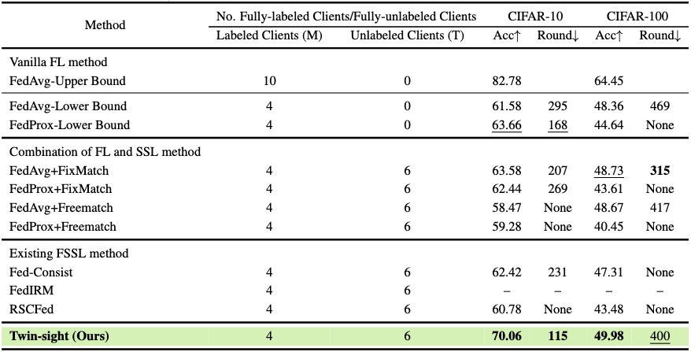
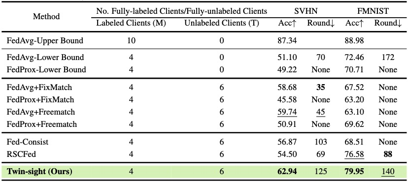

<p align="center">
    
</p>

<p align="center">
    <a href="https://openreview.net/forum?id=qxLVaYbsSI"></a>
      <a href="https://iclr.cc/"></a>
    <a href="https://github.com/visitworld123/Twin-sight"></a>
    <a href="https://github.com/visitworld123/Twin-sight/blob/main/LICENSE"></a>
    
</p>
<h1 align="center">Robust Training of Federated Models with <br/>Extremely Label Deficiency (ICLR 2024)</h1>

[Yonggang Zhang*](https://yonggangzhangben.github.io/index.html), Zhiqin Yang*, [Xinmei Tian](https://scholar.google.com/citations?user=-tels3wAAAAJ&hl=zh-CN&oi=ao), [Nannan Wang](https://scholar.google.com/citations?user=SRBn7oUAAAAJ&hl=zh-CN&oi=ao), [Tongliang Liu](https://tongliang-liu.github.io/), [Bo Han](https://bhanml.github.io/)

**Keywords**:  Fderated Learning, Label Deficiency, Gradient Conflict.

**Abstract**:Federated semi-supervised learning (FSSL) has emerged as a powerful paradigm for collaboratively training machine learning models using distributed data with label deficiency. Advanced FSSL methods predominantly focus on training a single model on each client. However, this approach could lead to a discrepancy between the objective functions of labeled and unlabeled data, resulting in gradient conflicts. To alleviate gradient conflict, we propose a novel twin-model paradigm, called **Twin-sight**, designed to enhance mutual guidance by providing insights from different perspectives of labeled and unlabeled data. In particular, Twin-sight concurrently trains a supervised model with a supervised objective function while training an unsupervised model using an unsupervised objective function. To enhance the synergy between these two models, Twin-sight introduces a neighbourhood-preserving constraint, which encourages the preservation of the neighbourhood relationship among data features extracted by both models. Our comprehensive experiments on four benchmark datasets provide substantial evidence that Twin-sight can significantly outperform state-of-the-art methods across various experimental settings, demonstrating the efficacy of the proposed Twin-sight.

## The Table of Contents


:wink: If Twin-sight is helpful to you, please star this repo. Thanks! :hugs: 
- [:grimacing: Dependencies and installation](#grimacing-dependencies-and-installation)
- [:partying\_face: How to run](#partying_face-how-to-run)
- [:evergreen\_tree: Detail of Twin-sight](#evergreen_tree-detail-of-twin-sight)
- [:rose: Experimental results](#rose-experimental-results)
- [:smiley: Citation](#smiley-citation)
- [:closed\_book: License](#closed_book-license)
- [:smiling\_face\_with\_three\_hearts: Acknowledgement](#smiling_face_with_three_hearts-acknowledgement)
- [:phone: Contact](#phone-contact)
- [:star: Star History](#star-star-history)

##  :grimacing: Dependencies and installation
Before running or modifying the code, you need to:
- Make sure Anaconda or Miniconda is installed.
- Clone this repo to your machine.
  
  ```
  # git clone this repository
  git clone https://github.com/visitworld123/Twin-sight
  cd Twin-sight

  # create new anaconda env 
  conda create -n Twin-sight python=3.8 -y
  conda activate Twin-sight
  ```
- required environment in `environment.yaml`
  ```
  # install environment dependencies
  conda env create -f environment.yaml
  ```
- required packages in `requirements.txt`
  ```
  # install python dependencies
  pip install -r requirements.txt
  ```

## :partying_face: How to run:

```
python main.py
```

In config.yaml, you can change the hyper-parameters and some settings. In our experiments, we use wandb as the default tool to record the running metrics like Acc and Loss. **Change recording tool:** If you want to use tensorboard to record, you can set `record_tool = 'tensorboard`.

Please refer to the `./configs/default.py` file for the list of hyper-parameters. We list some main parameters and its meaning for  quick start. 

You can set these parameters by modify  `default.py` or a new `yaml` file and use it by `python main.py --config_file xxx.yaml` to indicate a certain config file.

`--client_num_in_total`: The total number of clients in FL system, you can set 10 and 100 to reproduce our experiments.

`--client_num_per_round`: The number of sampled clients every round, also called sampling rate.

`--partition_alpha`: Our main results based on LDA partition method, you can set 0.1 and 0.05.

`--global_epochs_per_round`: Local epochs for every client.

`--comm_round`: Global Communication round.

`--SSFL_setting`: Which SSFL setting we standalone, you can choose `partial_client` or `partial_data`. Partial_client (PC) means partial clients have fully-labeled data, and other clients have fully-unlabeled data. It is also the focus of our discussion in this paper. Partial_data (PD) means every client has partially labeled data.

`--SSL_method`: The pesudo-label strategy. We can choose `fixmatch` or `freematch`.

`--model`: There are three different models we can choose which represents different self-supervised model including `SemiFed_SimCLR`, `SemiFed_SimSiam`, `SemiFed_BYOL`.

## :evergreen_tree: Detail of our method:
The main code of Twin-sight is in `trainers/normal_trainer.py`. In this file, the function of `train_semiFed_model_labeled_client_PC` performs the training process of the fully-labeled client under a partial_client setting. At the same time, `train_semiFed_model_unlabeled_client_PC` conducts training of fully-unlabeled clients under this setting.

`model/SemiFed.py` includes the model architecture of each local client. It is consisted of a unsup_model (SimCLR, BYOL, SimSiam) and a sup_model (ResNet18 in our method).

## :rose: Experimental results
 <p align="center">
    
</p>
 <p align="center">
    
</p>

## :smiley: Citation
If our work is useful for your research, please consider citing:

    @inproceedings{
        zhang2024robust,
        title={Robust Training of Federated Models with Extremely Label Deficiency},
        author={Yonggang Zhang and Zhiqin Yang and Xinmei Tian and Nannan Wang and Tongliang Liu and Bo Han},
        booktitle={The Twelfth International Conference on Learning Representations},
        year={2024},
        url={https://openreview.net/forum?id=qxLVaYbsSI}
    }

    @inproceedings{
        yang2023fedfed,
        title={FedFed: Feature Distillation against Data Heterogeneity in Federated Learning},
        author={Zhiqin Yang and Yonggang Zhang and Yu Zheng and Xinmei Tian and Hao Peng and Tongliang Liu and Bo Han},
        booktitle={Thirty-seventh Conference on Neural Information Processing Systems},
        year={2023}
    }

## :closed_book: License

This project is licensed under <a rel="license" href=""> MIT</a>. Redistribution and use should follow this license.
## :smiling_face_with_three_hearts: Acknowledgement

This project is partly based on [VHL](https://github.com/wizard1203/VHL) and [FedEMA](https://github.com/EasyFL-AI/EasyFL/tree/master/applications/fedssl)

## :phone: Contact
If you have any questions, please feel free to reach me out at `yangzqccc@buaa.edu.cn`. 

## :star: Star History

[](https://star-history.com/#visitworld123/Twin-sight&Date)
